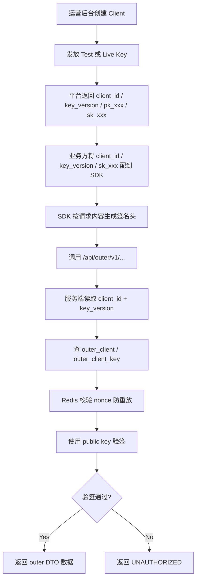

# Client Auth 设计说明

本文档用于定义 Answer Universe 对外客户端接入鉴权方案。该方案服务于 `outer v1`，并作为后续功能开发、数据库设计、后台管理页面和 SDK 实现的基线说明。

相关文档：

- [OuterQuestionsBaseAPI.md](/Users/funeye/IdeaProjects/answers-universe/docs/OuterQuestionsBaseAPI.md)

## QuickStart



## 1. 目标

当前客户端鉴权方案的目标不是建设一套复杂的通用 IAM 平台，而是解决以下具体问题：

- 为第三方业务方提供稳定的只读接入凭证
- 替代当前写死在环境变量中的旧鉴权方式
- 支持 SDK 统一签名
- 支持后台页面管理客户端凭证
- 支持密钥轮换
- 在平台侧尽量减少敏感信息存储风险

## 2. 方案选择

当前确定采用：

- 非对称签名鉴权

即：

- 平台生成密钥对
- 第三方业务方持有私钥
- 平台只保存公钥
- 请求由业务方使用私钥签名
- 服务端使用公钥验签

该方案相较于共享密钥方案的优势在于：

- 平台侧不需要保存私钥
- 数据库泄漏时，不会直接泄漏调用能力
- 密钥轮换语义更清晰

## 3. 凭证形态

虽然底层采用非对称签名，但业务侧配置体验仍然希望是字符串形态，并保留明确的环境前缀。

因此，凭证对外展示和配置的格式定义为：

- `pk_test_<encoded>`
- `sk_test_<encoded>`
- `pk_live_<encoded>`
- `sk_live_<encoded>`

说明：

- `pk` 表示对外展示的公钥字符串
- `sk` 表示对外展示的私钥字符串
- `test` / `live` 用于区分环境
- `<encoded>` 是对真实密钥材料做编码后的字符串

需要明确的是：

- 这些前缀不是算法自然生成的
- 而是平台对真实密钥材料的包装格式

SDK 在使用时需要：

1. 校验前缀是否合法
2. 识别环境
3. 去掉前缀
4. 解码密钥材料
5. 使用底层签名算法处理

## 4. 平台与业务方各自持有的信息

平台保存：

- `client_id`
- 公钥
- 密钥版本
- 状态
- 创建和更新时间

业务方持有：

- `client_id`
- 私钥

平台不保存私钥明文，也不支持后续再次查看私钥明文。

## 5. 私钥展示策略

当前方案明确采用：

- 平台生成密钥对
- 私钥只在生成成功时展示一次
- 支持复制
- 后续不再展示原始私钥

这意味着：

- 如果业务方遗失私钥，不提供找回能力
- 遗失后只能走轮换流程

这是当前安全与产品复杂度之间的平衡点。

## 6. 环境区分

建议客户端凭证按环境区分：

- `test`
- `live`

两套环境凭证独立管理，不共用。

原因：

- 测试环境方便联调
- 线上环境风险更可控
- 避免测试密钥误打到正式环境

## 7. 请求签名

当前请求签名方案的目标是：

- 确认调用方身份
- 防止请求被伪造
- 降低重放风险

### 7.1 建议请求头

当前建议至少包含以下请求头：

- `x-au-client-id`
- `x-au-key-version`
- `x-au-timestamp`
- `x-au-nonce`
- `x-au-signature`

是否额外传 `x-au-public-key` 取决于后续实现。当前更建议通过 `client_id + key_version` 在服务端查公钥，不要求每次请求携带完整公钥。

### 7.2 待签名内容

建议待签名原文至少包含：

- HTTP method
- request path
- canonical query string
- body hash
- timestamp
- nonce
- client_id
- key_version

这样做的目的是让签名与具体请求内容绑定，而不是只签一个松散字符串。

### 7.3 防重放

防重放建议至少做两件事：

- 校验时间窗口，例如 5 分钟
- `nonce` 短期去重，例如通过 Redis 记录短 TTL

## 8. 密钥轮换

当前方案下，轮换指的是生成一套全新的公私钥对，因此：

- 公钥会变
- 私钥也会变

不建议只换其中一个。

### 8.1 轮换原则

每次轮换应产生：

- 新的公钥
- 新的私钥
- 新的 `key_version`

### 8.2 轮换流程

建议流程如下：

1. 为指定客户端生成新的一套密钥
2. 保存新的公钥记录
3. 私钥只展示一次并允许复制
4. 新 key 进入可用状态
5. 老 key 保留短暂过渡期
6. 过渡期结束后禁用老 key

这个设计的意义在于：

- 避免业务方切换期间立即中断
- 保证轮换平滑

## 9. 后台管理能力

本项目需要建设客户端凭证管理页面。

当前建议至少包含以下能力：

- 客户端列表
- 客户端详情
- 创建客户端
- 生成测试环境密钥
- 生成正式环境密钥
- 轮换密钥
- 停用密钥
- 查看当前启用 key 版本
- 查看历史 key 版本

### 9.1 页面展示注意事项

页面层需要明确：

- 私钥只在生成成功的那一刻显示
- 支持复制纯文本
- 后续页面只显示摘要信息，不显示原始私钥

## 10. 数据库存储原则

当前方案的核心原则非常简单：

- 保存公钥
- 不保存私钥明文

因此数据库设计时，平台侧不需要处理“私钥加密存库再解密验签”的复杂逻辑。

建议后续至少会有两类表：

- 客户端主表
- 客户端密钥版本表

主表保存客户端基础信息，密钥表保存：

- `client_id`
- `environment`
- `key_version`
- `public_key`
- `status`
- `created_at`
- `expired_at`
- `last_used_at`

## 11. SDK 配置关系

SDK 侧至少需要以下鉴权配置项：

```ts
type AnswersUniverseAuthOptions = {
  clientId: string;
  publicKey: string;
  privateKey: string;
  version?: 'v1';
};
```

说明：

- `publicKey` 与 `privateKey` 都是带前缀的字符串配置
- SDK 自己负责解析和验前缀
- 默认版本固定为 `v1`

## 12. 与当前旧方案的关系

当前仓库中旧的 `outer` 鉴权方式是：

- `x-outer-identity-provider`
- `Authorization: Bearer <token>`

这是一个临时方案，不再继续演进。

后续开发应按本文档切换到：

- 客户端签名鉴权
- 版本化密钥
- 后台可管理凭证

## 13. 包发布策略

当前仓库可以保留 monorepo 结构来承载：

- `web` 应用
- `sdk`
- 仓内共享协议定义

真正需要发布到内部 npm 仓库的有：

- `@windrun-huaiin/faq-contracts`
- `@windrun-huaiin/faq-sdk`

其中：

- `contracts` 负责承载稳定的共享协议类型
- `sdk` 负责承载鉴权、签名、分组并发、请求封装等接入能力
- 业务方安装 `sdk` 时，也应安装匹配版本的 `contracts`

## 14. 一句话结论

客户端鉴权未来的稳定形态应是：平台生成带 `pk_test/sk_test/pk_live/sk_live` 前缀包装的非对称密钥字符串，业务方仅保存私钥并通过 SDK 发起签名请求，平台只保存公钥并在后台支持创建、轮换、停用和版本管理。
