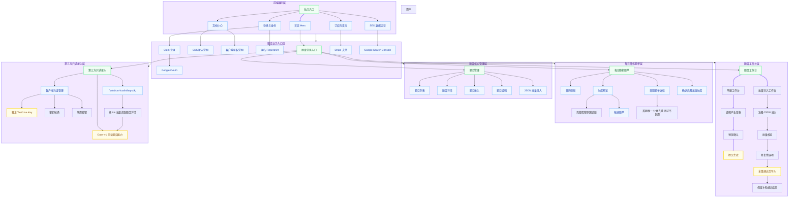
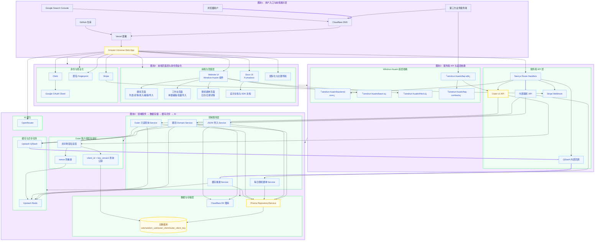

# Answer Universe 架构设计图

本文档基于当前项目设计文档整理，分为产品架构与技术架构两部分。

## 产品架构

```mermaid
flowchart TB
    User[用户]

    subgraph Layer1["前端展示层"]
        direction TB
        Entry[站点入口]
        Home[首页 Hero]
        Docs[文档中心]
        Auth[登录与身份]
        Billing[订阅与支付]
        SEO[SEO 数据运营]

        Entry --> Home
        Entry --> Docs
        Entry --> Auth
        Entry --> Billing
        Entry --> SEO
    end

    subgraph Layer2["题库业务入口层"]
        direction TB
        QuestionHub[题库业务入口]
        SDKGuide[SDK 接入说明]
        AuthGuide[客户端鉴权说明]
        Anonymous[匿名 Fingerprint]
        Clerk[Clerk 登录]
        GoogleOAuth[Google OAuth]
        Stripe[Stripe 支付]
        GSC[Google Search Console]

        Home --> QuestionHub
        Docs --> SDKGuide
        Docs --> AuthGuide
        Auth --> Anonymous
        Auth --> Clerk
        Clerk --> GoogleOAuth
        Billing --> Stripe
        SEO --> GSC
    end

    subgraph Layer3["题目核心管理层"]
        direction TB
        Questions[题目管理]
        QuestionList[题目列表]
        QuestionDetail[题目详情]
        QuestionCreate[题目录入]
        QuestionEdit[题目编辑]
        QuestionImport[JSON 批量导入]

        QuestionHub --> Questions
        Questions --> QuestionList
        Questions --> QuestionDetail
        Questions --> QuestionCreate
        Questions --> QuestionEdit
        Questions --> QuestionImport
    end

    subgraph Layer4["题目工作台层"]
        direction TB
        Workbench[题目工作台]
        SingleWorkbench[单题工作台]
        Draft[编辑产生草稿]
        Preview[预览确认]
        Submit[提交生效]
        ImportWorkbench[批量导入工作台]
        PrepareBatch[准备 JSON 批次]
        ValidateBatch[批量校验]
        FixInvalid[修复错误项]
        ImportBatch[全量通过后导入]
        BatchResult[保留本轮统计结果]

        QuestionHub --> Workbench
        Workbench --> SingleWorkbench
        SingleWorkbench --> Draft
        Draft --> Preview
        Preview --> Submit
        Workbench --> ImportWorkbench
        ImportWorkbench --> PrepareBatch
        PrepareBatch --> ValidateBatch
        ValidateBatch --> FixInvalid
        FixInvalid --> ImportBatch
        ImportBatch --> BatchResult
    end

    subgraph Layer5["每日随机题单层"]
        direction TB
        DailyQuiz[每日随机题单]
        Calendar[日历视图]
        DateDetail[日期题单详情]
        Generate[生成预览]
        Regenerate[确认后覆盖重生成]
        Diagnostics[完整阻塞原因诊断]
        CandidateList[候选题单]
        RandomRules[首题唯一 分类去重 历史不复用]

        QuestionHub --> DailyQuiz
        DailyQuiz --> Calendar
        DailyQuiz --> DateDetail
        DailyQuiz --> Generate
        DailyQuiz --> Regenerate
        Generate --> Diagnostics
        Generate --> CandidateList
        DateDetail --> RandomRules
    end

    subgraph Layer6["第三方只读接入层"]
        direction TB
        OuterSDK[第三方只读接入]
        ClientAdmin[客户端凭证管理]
        FAQSDK[「windrun-huaiin/faq-sdk」]
        ReadOnlyAPI[Outer v1 只读题目能力]
        KeyIssue[签发 Test/Live Key]
        KeyRotate[密钥轮换]
        KeyDisable[停用密钥]
        GetByIds[按 ids 批量读取题目详情]

        QuestionHub --> OuterSDK
        OuterSDK --> ClientAdmin
        OuterSDK --> FAQSDK
        OuterSDK --> ReadOnlyAPI
        ClientAdmin --> KeyIssue
        ClientAdmin --> KeyRotate
        ClientAdmin --> KeyDisable
        FAQSDK --> GetByIds
        GetByIds --> ReadOnlyAPI
    end

    %% 主干垂直分层连接（清晰层级流动）
    Layer1 --> Layer2
    Layer2 --> Layer3
    Layer2 --> Layer4
    Layer2 --> Layer5
    Layer2 --> Layer6

    %% 关键路径加粗柔和紫色
    linkStyle 0,20,21,22,23,24 stroke:#a78bfa,stroke-width:3.5px

    classDef layer fill:#f3e8ff,stroke:#c4b5fd,stroke-width:3px,color:#4c1d95
    classDef main fill:#f0fdf4,stroke:#86efac,stroke-width:2.5px,color:#166534
    classDef sub fill:#eff6ff,stroke:#93c5fd,stroke-width:2px,color:#1e40af
    classDef key fill:#fefce8,stroke:#fde047,stroke-width:3px,color:#854d0e

    class Layer1,Layer2,Layer3,Layer4,Layer5,Layer6 layer
    class Entry,QuestionHub,Questions,Workbench,DailyQuiz,OuterSDK main
    class Home,Docs,Auth,Billing,SEO,SDKGuide,AuthGuide,Anonymous,Clerk,GoogleOAuth,Stripe,GSC,QuestionList,QuestionDetail,QuestionCreate,QuestionEdit,QuestionImport,Calendar,DateDetail,Generate,Regenerate,CandidateList,ClientAdmin,FAQSDK,ReadOnlyAPI sub
    class Submit,ImportBatch,KeyIssue,ReadOnlyAPI key
```

## 技术架构

```mermaid
flowchart TB

    %% ==================== 图块 1：入口与前端层 ====================
    subgraph Block1["图块1：用户入口与前端展示层"]
        direction TB

        Browser[浏览器用户]
        SDKConsumer[第三方业务服务端]
        GSC[Google Search Console]
        CloudflareDNS[Cloudflare DNS]
        Vercel[Vercel 部署]
        Github[GitHub 仓库]
        NextApp[Answer Universe Web App]

        Browser --> CloudflareDNS
        SDKConsumer --> CloudflareDNS
        GSC --> CloudflareDNS
        CloudflareDNS --> Vercel
        Github --> Vercel
        Vercel --> NextApp
    end

    %% ==================== 图块 2：前端页面与身份商业化 ====================
    subgraph Block2["图块2：前端页面层与身份商业化"]
        direction TB

        subgraph Frontend["前端与页面层"]
            direction TB
            WebsiteUI[Website UI<br/>Windrun-Huaiin 组件]
            DocsUI[Docs UI<br/>Fumadocs]
            I18n[国际化与主题导航]
            QuestionPages[题库页面<br/>列表/详情/录入/编辑/导入]
            WorkbenchPages[工作台页面<br/>单题编辑/批量导入]
            RandomPages[随机题单页面<br/>日历/日期详情]
            DocsSite[设计文档与 SDK 文档]

            NextApp --> WebsiteUI
            NextApp --> DocsUI
            NextApp --> I18n
            WebsiteUI --> QuestionPages
            WebsiteUI --> WorkbenchPages
            WebsiteUI --> RandomPages
            DocsUI --> DocsSite
        end

        subgraph AuthBilling["身份与商业化"]
            direction TB
            Fingerprint[匿名 Fingerprint]
            Clerk[Clerk]
            GoogleOAuth[Google OAuth Client]
            Stripe[Stripe]

            NextApp --> Fingerprint
            NextApp --> Clerk
            Clerk --> GoogleOAuth
            NextApp --> Stripe
        end

        NextApp --> Frontend
        NextApp --> AuthBilling
    end

    %% ==================== 图块 3：服务端与底层依赖 ====================
    subgraph Block3["图块3：服务端 API 与底层依赖"]
        direction TB

        subgraph API["服务端 API 层"]
            direction TB
            RouteHandlers[Next.js Route Handlers]
            InternalAPI[内部题库 API]
            OuterAPI[Outer v1 API]
            QStashWebhook[QStash 内部回调]
            StripeWebhook[Stripe Webhook]

            NextApp --> RouteHandlers
            RouteHandlers --> InternalAPI
            RouteHandlers --> OuterAPI
            RouteHandlers --> QStashWebhook
            RouteHandlers --> StripeWebhook
        end

        subgraph WindrunBase["Windrun-Huaiin 底层依赖"]
            direction TB
            BackendCore[「windrun-huaiin/backend-core」]
            BaseUI[「windrun-huaiin/base-ui」]
            ThirdUI[「windrun-huaiin/third-ui」]
            FAQSDK[「windrun-huaiin/faq-sdk」]
            FAQContracts[「windrun-huaiin/faq-contracts」]

            WebsiteUI --> BaseUI
            WebsiteUI --> ThirdUI
            RouteHandlers --> BackendCore
            SDKConsumer --> FAQSDK
            FAQSDK --> FAQContracts
            FAQSDK --> OuterAPI
        end

        Stripe --> StripeWebhook
    end

    %% ==================== 图块 4：领域服务、数据、缓存与 AI ====================
    subgraph Block4["图块4：领域服务 → 数据存储 → 缓存异步 → AI"]
        direction TB

        subgraph Domain["领域服务层"]
            direction TB
            QuestionService[题目 Domain Service]
            ImportService[JSON 导入 Service]
            RandomService[每日随机题单 Service]
            OuterReadService[Outer 只读查询 Service]
            CacheRebuildService[缓存重建 Service]

            InternalAPI --> QuestionService
            InternalAPI --> ImportService
            InternalAPI --> RandomService
            OuterAPI --> OuterReadService
            QStashWebhook --> CacheRebuildService
        end

        subgraph Data["数据与存储层"]
            direction TB
            Prisma[Prisma Repository/Service]
            DB[(主数据库<br/>usb/random_usb/outer_client/outer_client_key)]
            R2[Cloudflare R2 图库]

            QuestionService --> Prisma
            ImportService --> Prisma
            RandomService --> Prisma
            OuterReadService --> Prisma
            CacheRebuildService --> Prisma
            Prisma --> DB
            QuestionService --> R2
            ImportService --> R2
        end

        subgraph CacheQueue["缓存与异步任务"]
            direction TB
            Redis[Upstash Redis]
            QStash[Upstash QStash]

            QuestionService --> Redis
            OuterReadService --> Redis
            CacheRebuildService --> Redis
            QuestionService --> QStash
            ImportService --> QStash
            OuterReadService --> QStash
            QStash --> QStashWebhook
        end

        subgraph AI["AI 能力"]
            direction TB
            OpenRouter[OpenRouter]

            NextApp --> OpenRouter
        end

        subgraph OuterAuth["Outer 客户端签名鉴权"]
            direction TB
            Signature[非对称签名验签]
            ClientKey[client_id + key_version 查询公钥]
            Nonce[nonce 防重放]

            OuterAPI --> Signature
            Signature --> ClientKey
            ClientKey --> DB
            Signature --> Nonce
            Nonce --> Redis
        end

        Domain --> Data
        Domain --> CacheQueue
        Domain --> OuterAuth
    end

    %% 主干关键路径（垂直贯穿）
    Block1 --> Block2
    Block2 --> Block3
    Block3 --> Block4

    %% 关键路径加粗柔和紫色
    linkStyle 0,20,35,50 stroke:#a78bfa,stroke-width:3.5px

    classDef block fill:#f3e8ff,stroke:#c4b5fd,stroke-width:3.5px,color:#4c1d95
    classDef layer fill:#f0fdf4,stroke:#86efac,stroke-width:2.5px,color:#166534
    classDef sub fill:#eff6ff,stroke:#93c5fd,stroke-width:2px,color:#1e40af
    classDef key fill:#fefce8,stroke:#fde047,stroke-width:3px,color:#854d0e

    class Block1,Block2,Block3,Block4 block
    class Frontend,AuthBilling,API,WindrunBase,Domain,Data,CacheQueue,AI,OuterAuth layer
    class WebsiteUI,DocsUI,I18n,QuestionPages,WorkbenchPages,RandomPages,DocsSite,Fingerprint,Clerk,GoogleOAuth,Stripe,RouteHandlers,InternalAPI,OuterAPI,QStashWebhook,StripeWebhook,BackendCore,BaseUI,ThirdUI,FAQSDK,FAQContracts,QuestionService,ImportService,RandomService,OuterReadService,CacheRebuildService,Prisma,DB,R2,Redis,QStash,OpenRouter,Signature,ClientKey,Nonce sub
    class NextApp,QuestionHub,OuterAPI,Prisma,DB key
```
